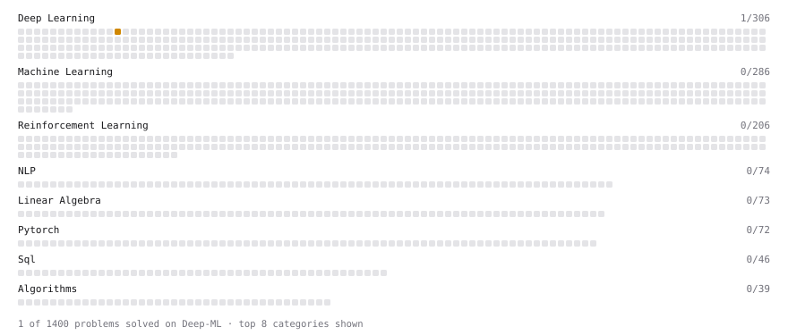

# Deep-ML

My machine learning practice from [Deep-ML](https://www.deep-ml.com). Every solution here was written by hand.

**6** solved · 6 problems · 0 labs · 0 math

[**Browse the interactive portfolio**](https://Abhigyan-Shekhar-design.github.io/deep-ml/) to replay this filling in over time.

## Problems

| | Difficulty | Solved | |
| --- | --- | --- | --- |
| [Implement ReLU Activation Function](https://www.deep-ml.com/problems/42) | easy | 2026-09-15 | [solution](problems/0042-implement-relu-activation-function) |
| [Implement Ridge Regression Loss Function](https://www.deep-ml.com/problems/43) | easy | 2026-09-15 | [solution](problems/0043-implement-ridge-regression-loss-function) |
| [Leaky ReLU Activation Function](https://www.deep-ml.com/problems/44) | easy | 2026-09-15 | [solution](problems/0044-leaky-relu-activation-function) |
| [Linear Kernel Function](https://www.deep-ml.com/problems/45) | easy | 2026-09-15 | [solution](problems/0045-linear-kernel-function) |
| [Implement Adam Optimization Algorithm](https://www.deep-ml.com/problems/49) | medium | 2026-09-15 | [solution](problems/0049-implement-adam-optimization-algorithm) |
| [Implementing a Simple RNN](https://www.deep-ml.com/problems/54) | medium | 2026-09-15 | [solution](problems/0054-implementing-a-simple-rnn) |

---

_This file is regenerated by Deep-ML on every push._
